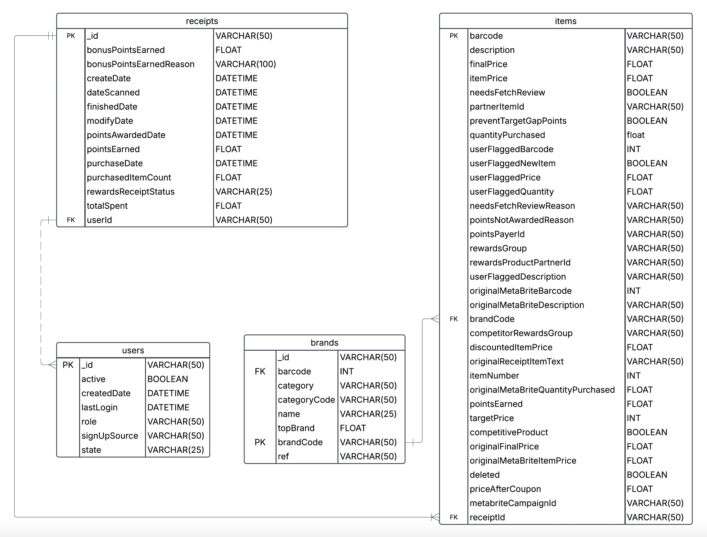

# fetch-rewards
Take home assessment for Fetch Rewards Analytics Engineer position.

### Entity Relationship Diagram

Below is the entity relationship diagram (ERD). This ERD includes the data from the three data files provided, which also required a fourth table that I named items.

### Business Questions

##### What are the top 5 brands by receipts scanned for most recent month?
##### How does the ranking of the top 5 brands by receipts scanned for the recent month compare to the ranking for the previous month?

I wrote my SQL queries in Google BigQuery using Google Standard SQL. For the first two questions, it is difficult to answer because the items that were included on scanned receipts in the most recent month as well as the prior month are null. Normally, I would use the [scanned_receipts.sql](sql_queries/scanned_receipts.sql) query to return the top 5 brands by receipts scanned for most recent month. I've included the [receipt_exploring.sql](sql_queries/receipt_exploring.sql) query to show that there were not any top brands included in scanned receipts in February or March (the most recent month).

Included in the brands table is a column called `topBrand` which is a binary datatype. For this, I assumed that 1 is considered a top brand, and 0's or null values are not a top brand. This would require further clarification.

##### When considering average spend from receipts with 'rewardsReceiptStatus’ of ‘Accepted’ or ‘Rejected’, which is greater?

The SQL query [receipt_status.sql](receipt_status.sql) is what I used to answer the next two questions. For this question, I made the assumption that 'Accepted' is the same as 'Finished' because there was not an 'Accepted' `rewardsReceiptStatus`.  The average spend of items with an 'Accepted' status was $80.85, which is much greater than the $23.33 average spend from 'Rejected' receipt statuses.

##### When considering total number of items purchased from receipts with 'rewardsReceiptStatus’ of ‘Accepted’ or ‘Rejected’, which is greater?

Answering this question relies on the same assumption made in the previous solution. Similarly, the total quantity of 'Accepted' items was much higher than 'Rejected' 8,184 items were accepted compared to the 173 items that had a rejected receipt status. 

### Data Quality Issues

There were a few things in the data provided that raise data quality concerns, and at the very least require clarification from stakeholders. One of the biggest issues was the missing brand name in the receipts that were scanned recently. This can be seen in the [receipt_exploring.sql](sql_queries/receipt_exploring.sql) query linked above, as well as the 

Another concerning piece of this dataset is the amount of null barcodes in the items dataset. Assuming the barcode is needed to know what brands of items and cpg's are purchased, and the business model relies on understanding consumer behavior, trying to lower the amount of nulls in this table would be very important. One of the questions I have that's related to this data is - 'What does deleted mean?' The deleted column is a boolean datatype, and I would assume that 0 means not deleted, and 1 is deleted, but this would require further clarification. 

